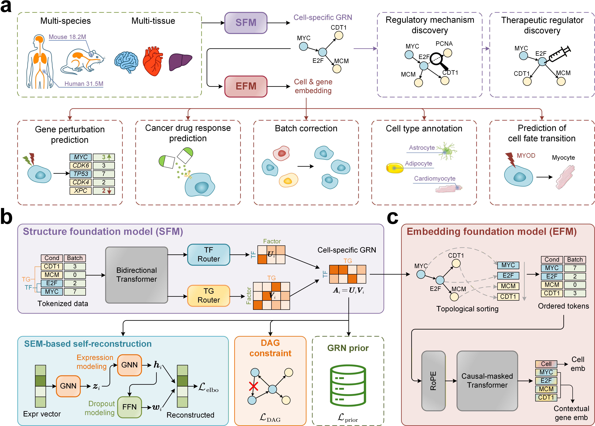

<h1 align="center">Building a causality-aware single-cell RNA-seq foundation model via context-specific causal regulation modeling</h1>

<p align="center">
  <strong>A causality-aware foundation model for single-cell transcriptomics</strong>
</p>

<p align="center">
  <a href="https://huggingface.co/kaichenxu/scCAFM">
    
  </a>
  <a href="https://www.gnu.org/licenses/gpl-3.0.en.html">
    
  </a>
  
</p>

**scCAFM** learns context-specific gene-regulatory structure together with transferable gene and cell representations from single-cell RNA sequencing data. It combines a **Structure Foundation Module (SFM)** for regulatory modeling with an **Embedding Foundation Module (EFM)** guided by the structure learned by SFM.

<p align="center">
  
</p>

## What scCAFM provides

- **Cell-specific gene-regulatory networks:** infer a TF-to-target network for every cell while preserving cellular heterogeneity.
- **Pooled gene-regulatory networks:** summarize cell-specific networks into one network for a population of cells.
- **Structure-guided representations:** learn gene and cell embeddings informed by context-specific regulatory structure.
- **Human and mouse support:** use shared vocabularies, transcription-factor catalogues, and cross-species resources.
- **Memory-aware result generation:** stream cell-specific networks and optionally retain edges by score threshold or top-k selection.

The model is designed for research in gene regulation, cellular heterogeneity, perturbation response, developmental biology, and related single-cell applications.

## Get started

scCAFM supports Python 3.10–3.14; Python 3.12.9 is recommended. A CUDA-capable GPU is recommended for model inference and training.

Clone the repository and install the package:

```bash
git clone https://github.com/Catchxu/scCAFM.git
cd scCAFM
pip install .
```

For the pinned Python 3.12 environment, use:

```bash
pip install ".[py312]"
```

Download the pretrained model and shared resources from [Hugging Face](https://huggingface.co/kaichenxu/scCAFM):

```bash
pip install -U huggingface_hub
hf download kaichenxu/scCAFM --local-dir assets
```

The `assets/` directory is intentionally not tracked by Git. Its release manifest keeps the model weights, vocabularies, TF catalogues, and prior-knowledge resources in a consistent layout.

## Explore the tutorials

| Tutorial | What it demonstrates |
|---|---|
| [Recovering ChIP-seq GRNs from homogeneous cell populations](docs/chipseq_grn_recovery.ipynb) | Preprocess hESC and mESC data, infer pooled GRNs, and compare them with ChIP-seq reference networks |
| [Inferring cell-specific GRNs in heterogeneous cell populations](docs/cell_specific_grns.ipynb) | Preprocess mouse pancreas data, generate cell-specific GRNs, inspect representative edges |
| [Validating regulatory edges with Perturb-seq](docs/perturbseq_edge_validation.ipynb) | Infer a pooled K562 GRN and summarize perturbation responses across the top 100 edges with a mean Wasserstein distance |

The tutorials are intentionally concise and focus on biological use rather than training internals.

## Choose an attention backend

scCAFM supports FlashAttention-4 (FA4) and FlashAttention-2 (FA2). FA4 is intended for compatible Blackwell GPUs such as the B200; use FA2 when your hardware or software stack does not support FA4. Follow the [FlashAttention installation instructions](https://github.com/Dao-AILab/flash-attention) for your CUDA and PyTorch environment.

Validate the selected backend before running a large job:

```bash
PYTHONPATH=. python test/test_FA4.py
# Or, for FA2:
PYTHONPATH=. python test/test_FA2.py
```

## Find your way around the repository

| Path | Contents |
|---|---|
| `src/sccafm/` | Public package, model implementations, preprocessing, GRN tasks, and training code |
| `docs/` | Task-oriented notebooks for GRN inference and validation |
| `configs/` | Model and training configurations |
| `data/` | Data acquisition and preparation utilities |
| `test/` and `tests/` | Backend checks and automated tests |
| `assets/` | Ignored local directory for pretrained weights and shared resources |

For dataset acquisition and vocabulary-aware preparation, see the [data pipeline guide](data/README.md). For checkpoint contents, intended use, and model limitations, see the [Hugging Face model card](https://huggingface.co/kaichenxu/scCAFM).

## Use scCAFM responsibly

scCAFM is a research model and is not intended for clinical diagnosis or treatment decisions. Predicted regulatory relationships are computational hypotheses and should be validated with suitable experimental or independent evidence. Results may vary across tissues, technologies, species, preprocessing choices, and biological contexts.

## Get support

Questions, bug reports, and feature requests are welcome through [GitHub Issues](https://github.com/Catchxu/scCAFM/issues).

## License

scCAFM is released under the [GNU General Public License v3.0](LICENSE).
