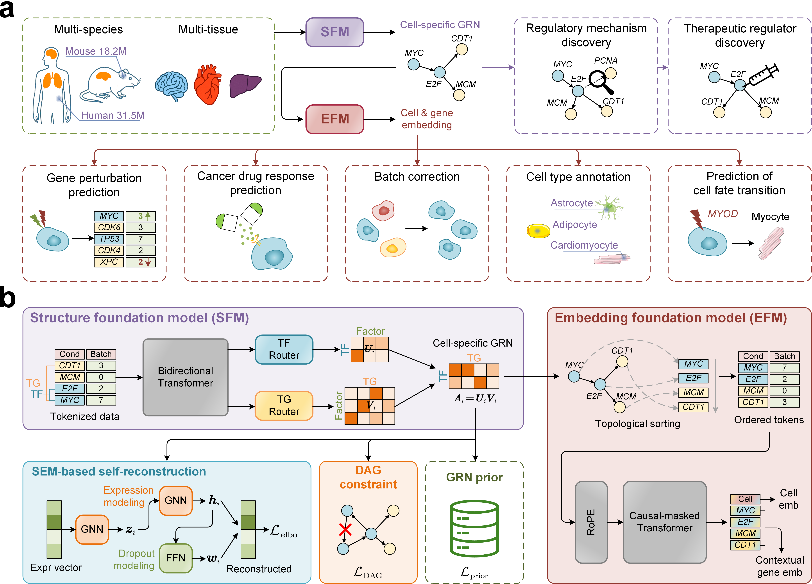

<h1 align="center">Building a causality-aware single-cell RNA-seq foundation model via context-specific causal regulation modeling</h1>

<p align="center">
  <a href="https://huggingface.co/kaichenxu/scCAFM">
    
  </a>
  <a href="https://www.gnu.org/licenses/gpl-3.0.en.html">
    
  </a>
  
</p>

**scCAFM** is a single-cell **Causality-Aware Foundation Model** pretrained on 49.7 million human and mouse cells to infer cell-specific gene regulatory networks (csGRNs) and learn transferable, contextual gene and cell embeddings. Its **Structure Foundation Module (SFM)** models causal regulatory relationships in a mixture-of-experts-mediated latent factor space, enabling scalable csGRN inference. Its **Embedding Foundation Module (EFM)** uses the inferred cell-specific causal gene orderings to learn causality-aware representations.

<p align="center">
  
</p>

## What scCAFM provides

- **Cell-specific causal gene regulatory networks:** infer directed transcription-factor-to-target relationships for individual cells to characterize heterogeneous regulatory programs and developmental dynamics.
- **Pooled gene regulatory networks:** aggregate cell-specific networks to characterize shared regulatory structure within a cell population.
- **Causality-aware gene and cell embeddings:** learn contextual representations that encode the regulatory relationships and hierarchies of inferred csGRNs.
- **Scalable regulatory inference:** perform causal discovery in a low-dimensional latent factor space to support csGRN inference at atlas scale.
- **Transfer to new datasets:** apply pretrained scCAFM in a zero-shot or fine-tuned setting to generate networks and embeddings for human and mouse scRNA-seq data.

The inferred networks and learned embeddings support downstream analyses including gene perturbation prediction, cell type annotation, batch correction, cancer drug response prediction, and prediction of perturbation-induced cell fate transitions.

## Install scCAFM

Use Linux with a CUDA-capable NVIDIA GPU supported by FlashAttention. scCAFM supports Python 3.10–3.14. Use an environment with a compatible CUDA-enabled PyTorch installation. GPU memory requirements depend on the number of genes and the inference batch size.

### Set up the environment

Activate your Python environment, then clone the repository:

```bash
git clone https://github.com/Catchxu/scCAFM.git
cd scCAFM
```

If PyTorch is not already installed, follow the [PyTorch installation instructions](https://pytorch.org/get-started/locally/) to select a build compatible with your system.

### Install FlashAttention

scCAFM uses **FlashAttention-4 (FA4)** by default (`attention_backend="fa4"`) on supported  Blackwell GPUs, such as B200 and RTX 6000 Pro. **FlashAttention-2 (FA2)** is also available as an alternative backend (`attention_backend="fa2"`). Install both packages when using FA4 because scCAFM also uses FA2's padding and rotary-embedding utilities. See the [FlashAttention documentation](https://github.com/Dao-AILab/flash-attention#flashattention-4-cutedsl) for hardware requirements.

**Optional: install a prebuilt FA2 wheel.** If FA2 is not already installed, you can avoid local compilation by choosing a wheel from the community-maintained [flash-attention-prebuild-wheels project](https://github.com/mjun0812/flash-attention-prebuild-wheels). Select version 2.8.3 or a newer 3.x release matching your Python, PyTorch, CUDA, and platform, then run:

```bash
pip install /path/to/downloaded.whl
```

Install the FlashAttention packages:

```bash
pip install packaging psutil ninja
pip install flash-attn --no-build-isolation
pip install flash-attn-4
```

An installed `flash-attn` package is reused. Otherwise, pip installs it and may compile it from source, which requires a compatible CUDA toolkit. If using only the FA2 backend, you can skip installing `flash-attn-4`.

Verify the default FA4 backend:

```bash
python tests/test_FA4.py
```

If using the FA2 fallback, set `attention_backend="fa2"` when loading the model and run `python tests/test_FA2.py` instead.

### Install the package

From the repository root, install scCAFM and its core dependencies:

```bash
pip install .
```

### Download the pretrained model

Download the [pretrained model and shared resources](https://huggingface.co/kaichenxu/scCAFM), which are required to run pretrained scCAFM on your own data or the tutorial datasets:

```bash
hf download kaichenxu/scCAFM --local-dir assets
```

By default, the model is downloaded to `assets/`. You can replace `assets` with another local path; use that path when loading the model.

## Explore the tutorials

We provide a series of tutorials to help users get started with scCAFM and apply it to common gene-regulatory-network tasks.

### Set up the tutorial environment

To run the notebooks with the provided dependency versions, create a separate Python 3.12 environment. From the repository root, run:

```bash
conda create -n sccafm-tutorial python=3.12
conda activate sccafm-tutorial
pip install torch==2.11.0 --index-url https://download.pytorch.org/whl/cu130
pip install hatchling==1.31.0 packaging psutil ninja
pip install ".[py312]" --no-build-isolation
```

This setup uses CUDA 13.0 and includes FA4, FA2, and the notebook dependencies. You can install a compatible prebuilt FA2 wheel before the final command as described above; the `py312` extra requires `flash-attn>=2.8.3`. The extra is only needed for the tutorial environment, not for general scCAFM use.

The notebooks expect the model and shared resources in `assets/` under the repository root:

```bash
hf download kaichenxu/scCAFM --local-dir assets
```

If you already downloaded the model elsewhere, update the model path in the notebooks to use that directory.

### Download tutorial data

To follow the notebooks step by step with the provided examples, download the [tutorial datasets](https://huggingface.co/datasets/kaichenxu/scCAFM-data). You can skip this download when adapting the workflows to your own data.

```bash
hf download kaichenxu/scCAFM-data --repo-type dataset --local-dir tutorial_data
```

The datasets total approximately 914 MB. The `tutorial_data/` directory matches the data paths used in the notebooks.

| Tutorial | What it demonstrates |
|---|---|
| [Inferring pooled GRNs from homogeneous cell populations with ChIP-seq-based benchmarking](docs/chipseq_grn_recovery.ipynb) | Preprocess hESC and mESC data, infer pooled GRNs, and compare them with ChIP-seq reference networks |
| [Inferring cell-specific GRNs from heterogeneous cell populations](docs/cell_specific_grns.ipynb) | Preprocess mouse-pancreas data, generate cell-specific GRNs, and inspect representative edges |
| [Inferring pooled GRNs from homogeneous cell populations with Perturb-seq-based validation](docs/perturbseq_edge_validation.ipynb) | Infer a pooled K562 GRN and validate highly ranked edges with Perturb-seq |

## Find your way around the repository

| Path | Contents |
|---|---|
| `src/sccafm/` | Public package, model implementations, preprocessing, GRN tasks, and training code |
| `docs/` | Task-oriented notebooks for GRN inference and validation |
| `configs/` | Model and training configurations |
| `data/` | Data acquisition and preparation utilities |
| `tests/` | Backend checks and automated tests |
| `assets/` | Ignored local directory for pretrained weights and shared resources |

For dataset acquisition and vocabulary-aware preparation, see the [data pipeline guide](data/README.md). For checkpoint contents, intended use, and model limitations, see the [Hugging Face model card](https://huggingface.co/kaichenxu/scCAFM).

## Use scCAFM responsibly

scCAFM is a research model and is not intended for clinical diagnosis or treatment decisions. Predicted regulatory relationships are computational hypotheses and should be validated with suitable experimental or independent evidence. Results may vary across tissues, technologies, species, preprocessing choices, and biological contexts.

## Get support

Questions, bug reports, and feature requests are welcome through [GitHub Issues](https://github.com/Catchxu/scCAFM/issues).

## License

scCAFM is released under the [GNU General Public License v3.0](LICENSE).
